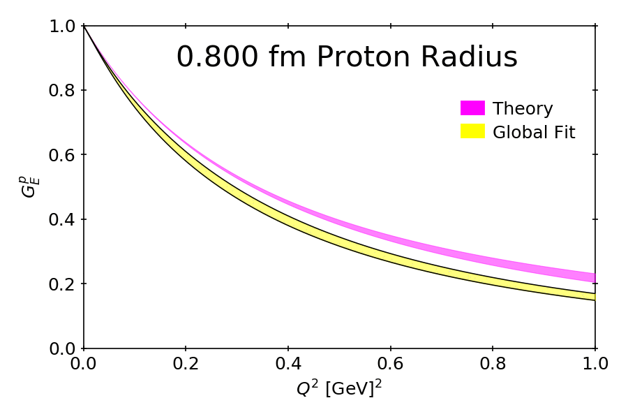

# Proton Radius Determination

Animation showing what happens to the charge form factor of the proton when different radii are used for both the data and the state-of-the-art model.   In the figure $G_E$ is the charge form factor of the proton and $Q^2$ is the four momentum transferred to the system (i.e. how hard the proton was struct).    

The details of the physics can be found in the open access Phys. Rev. C article:

J. M. Alarcón, D. W. Higinbotham, C. Weiss, and Zhihong Ye Phys. Rev. C 99, 044303 https://doi.org/10.1103/PhysRevC.99.044303

D. Higinbotham made the animation for the JLab press release that went along with the paper and it used by phys.org: https://phys.org/news/2019-06-physicists-team-tackle-proton-radius.html

The plots are referred to in the code as "Goldilocks" since by just watching the animation anyone can easily see which proton radius is just right. 
